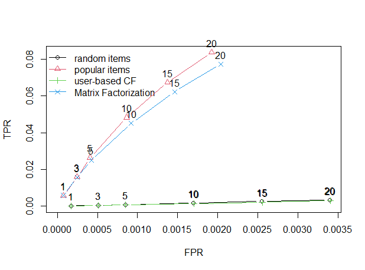
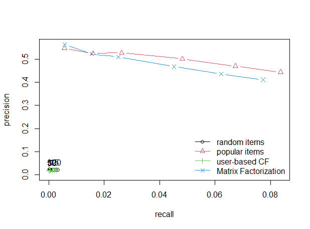

# Recommender Systems 

This project focuses on building and evaluating recommender systems using a movie ratings dataset. The project includes implementations in both R and Python, employing multiple algorithms to explore and compare the effectiveness of different recommendation strategies.

## Project Structure

- **R Implementation**: Using `recommenderlab` package to explore and compare the following algorithms:
  - RANDOM
  - POPULAR
  - UBCF (User-Based Collaborative Filtering)
  - RSVD (Matrix Factorization)

- **Python Implementation**: Using `scikit-learn` to build a Content-based linear recommender system.

## Files and Directories

- `recommender.R`: Contains the R code for implementing and comparing the recommender algorithms.
- `recommender.ipynb`: Jupyter notebook implementing a Content-based recommender system using a linear model.
- `graphs/`: Directory containing graphs of the results.

## Data

The project uses the [ml-10M100K](https://grouplens.org/datasets/movielens/10m/) dataset, which is a part of the MovieLens datasets provided by GroupLens Research. This dataset contains 10 million ratings and 100,000 tag applications applied to 10,000 movies by 72,000 users. The data is structured to include:
- User IDs
- Movie IDs
- Ratings (on a scale of 0.5 to 5.0)
- Timestamps (when the ratings were given)
- Tagging information

This and other GroupLens data sets are publicly available for download at [GroupLens Datasets](https://grouplens.org/datasets/).

## Results

- **ROC Curve**: Evaluate the performance of the algorithms in terms of true positive rate versus false positive rate.

  

- **Precision/Recall Graph**: Measure the precision and recall of the algorithms.

  

